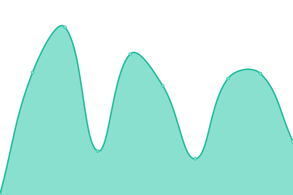

# [📈 Live Status](https://ds-wizard.github.io/status): <!--live status--> **🟩 All systems operational**

This repository contains the open-source uptime monitor and status page for [Data Stewardship Wizard](https://ds-wizard.org), powered by [Upptime](https://github.com/upptime/upptime).

With [Upptime](https://upptime.js.org), you can get your own unlimited and free uptime monitor and status page, powered entirely by a GitHub repository. We use [Issues](https://github.com/ds-wizard/status/issues) as incident reports, [Actions](https://github.com/ds-wizard/status/actions) as uptime monitors, and [Pages](https://ds-wizard.github.io/status) for the status page.

<!--start: status pages-->
<!-- This summary is generated by Upptime (https://github.com/upptime/upptime) -->
<!-- Do not edit this manually, your changes will be overwritten -->
<!-- prettier-ignore -->
| URL | Status | History | Response Time | Uptime |
| --- | ------ | ------- | ------------- | ------ |
|  [ds-wizard.org](https://ds-wizard.org) | 🟩 Up | [ds-wizard-org.yml](https://github.com/ds-wizard/status/commits/HEAD/history/ds-wizard-org.yml) | 

 180ms
     
 | 

<a href="https://ds-wizard.github.io/status/history/ds-wizard-org">100.00%</a>
    

|  [guide.ds-wizard.org](https://guide.ds-wizard.org) | 🟩 Up | [guide-ds-wizard-org.yml](https://github.com/ds-wizard/status/commits/HEAD/history/guide-ds-wizard-org.yml) | 

 238ms
     
 | 

<a href="https://ds-wizard.github.io/status/history/guide-ds-wizard-org">100.00%</a>
    

|  [ideas.ds-wizard.org](https://ideas.ds-wizard.org) | 🟩 Up | [ideas-ds-wizard-org.yml](https://github.com/ds-wizard/status/commits/HEAD/history/ideas-ds-wizard-org.yml) | 

 934ms
     
 | 

<a href="https://ds-wizard.github.io/status/history/ideas-ds-wizard-org">100.00%</a>
    

|  [localize.ds-wizard.org](https://localize.ds-wizard.org) | 🟩 Up | [localize-ds-wizard-org.yml](https://github.com/ds-wizard/status/commits/HEAD/history/localize-ds-wizard-org.yml) | 

 888ms
     
 | 

<a href="https://ds-wizard.github.io/status/history/localize-ds-wizard-org">99.78%</a>
    

|  [changelog.ds-wizard.org](https://changelog.ds-wizard.org) | 🟩 Up | [changelog-ds-wizard-org.yml](https://github.com/ds-wizard/status/commits/HEAD/history/changelog-ds-wizard-org.yml) | 

 218ms
     
 | 

<a href="https://ds-wizard.github.io/status/history/changelog-ds-wizard-org">100.00%</a>
    

<!--end: status pages-->

[**Visit our status website →**](https://ds-wizard.github.io/status)

## 📄 License

- Powered by: [Upptime](https://github.com/upptime/upptime)
- Code: [MIT](./LICENSE) © [Anand Chowdhary](https://anandchowdhary.com), supported by [Pabio](https://pabio.com)
- Data in the `./history` directory: [Open Database License](https://opendatacommons.org/licenses/odbl/1-0/)
